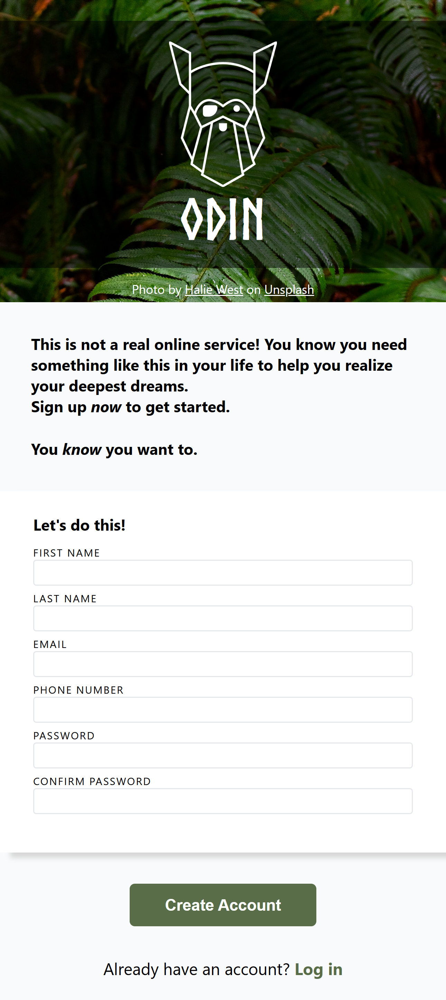
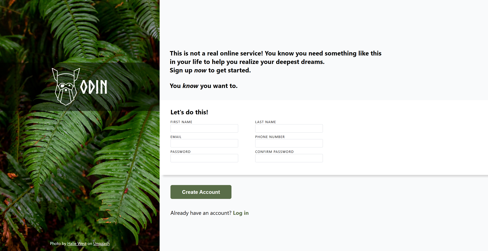

# Sign-up Form

Sign-up form is a project for the "Forms" section of the intermediate HTML & CSS course of [The Odin Project](https://github.com/TheOdinProject), consisting of recreating from zero a sign-up form page similar to the design below.

## Process

This sign-up form was really fun to recreate! I used a mobile-first approach to create a responsive layout (even though it wasn't realy a requirement), using flexbox and media queries to change the design of the page according to the size of the screen. The course only provided a desktop version of the design, so I came up with a mobile version myself!

Since this project is about a sign-up form, a big focus of it was creating the form in a well-structured and accessible way. Validation styles were applied to the inputs using CSS pseudoclasses, to ensure that it is clear to the user what kind of data is needed of them.

### Mobile layout and desktop layout:

